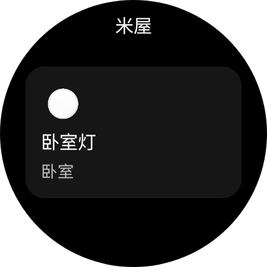
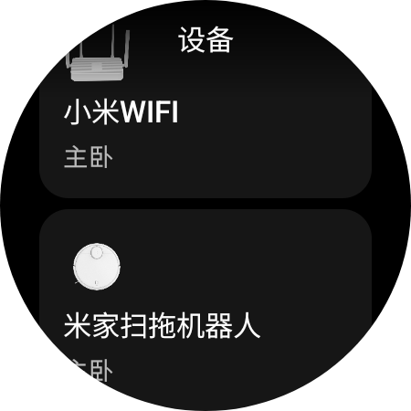
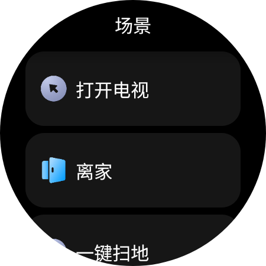
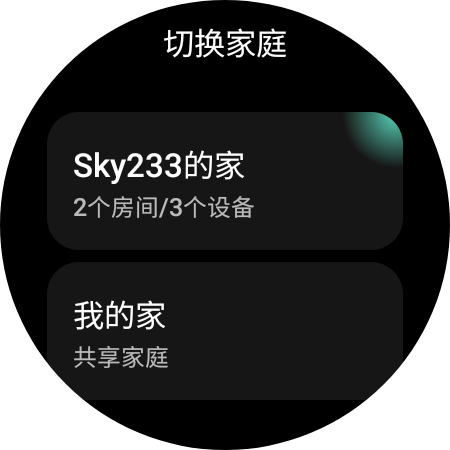

# 米屋

第三方手表版米家应用

<!--

-->

## 实机截图

> [!NOTE]
> 测试硬件平台为 **Galaxy Watch 5 44mm 蓝牙版**

   

## 目前进度

- [x] MiotSDK搭建
- [x] 控件框架搭建
- [x] 控制框架搭建
- [x] 设备框架搭建
- [ ] 开发文档编写
- [ ] 软件性能优化

## 目前支持米家设备

- 灯具
- 扫地机器人
- 烘干机
- 空调
- 温湿度传感器
- 空气净化器
- 加热器
- 宠物喂食器
- 开关
- 插座
- 除湿机
- 摄像头
- 扬声器
- 气体传感器
- 门窗传感器
- 风扇
- 加湿器
- 窗帘

未来会补充更多设备

需要新设备需求的请在**Issues**提出你的设备(产品名)全称并提供控制界面截图(请使用长截图功能)

## 为什么要重写？

因为之前的版本很拉，用的开发架构和技术已过时，加上设备控制架构的搭建不完善，于是决定重写。

## 重写能带来什么？

- 应用更加流畅稳定。
- 更方便各位为该项目进行更正修改，提出建议。
- ~~给我加分~~

## 智能穿戴软件开发交流群

QQ：547592539

## 致米家公司

一. 本开源项目仅供个人学习交流使用, 方便 Android 手表端可以控制米家的智能家居.

二. 本项目完全免费, 可能存在较多漏洞, 维护者仅保证自己能正常使用, 存在问题请通过项目页 Issues 反馈.

三. 本项目中所有适配的接口均来自小米公司 (北京小米科技有限责任公司) 旗下米家 (MIJIA), 本项目不对其控制的安全性负责.

四. 本项目会将账户、密码、家庭等信息, 缓存在安装设备本地, 不含任何上传个人信息的接口.

五. 真诚希望小米官方能够推出 `米家 For Android Watch`, 使广大消费者能用上.

六. 本项目仅供个人学习交流使用, 切勿进行传播、任何形式的盈利, 未涉及的问题请参见国家有关法律法规, 以国家法律法规为准.

> [!NOTE]
> 如果米家公司需要该项目下架请直接发邮件到**sky233ml@qq.com**
> 
> ~~别让我给钱就成，我是学生~~
